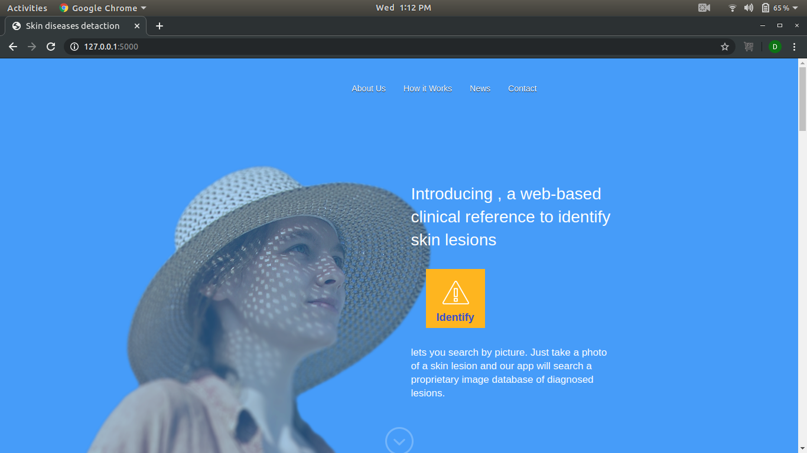
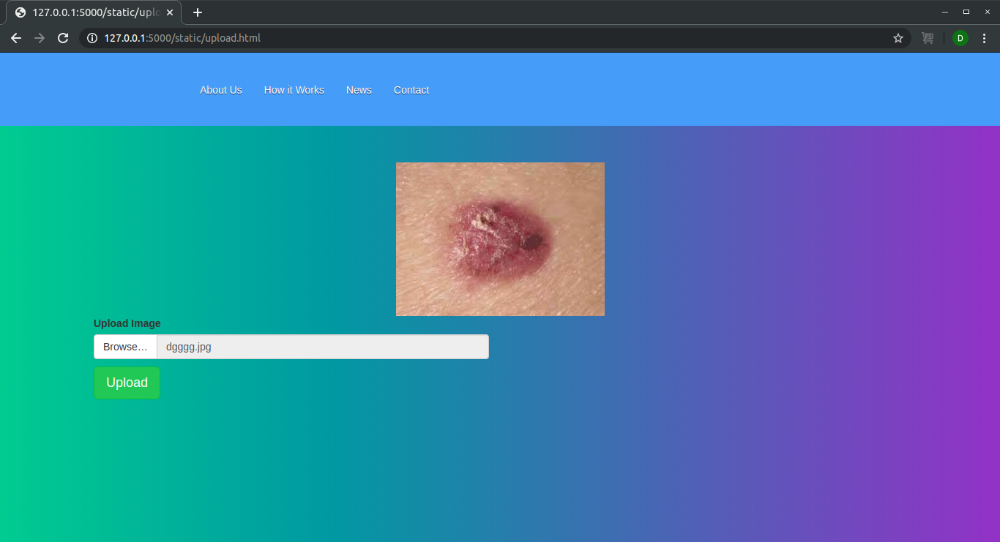
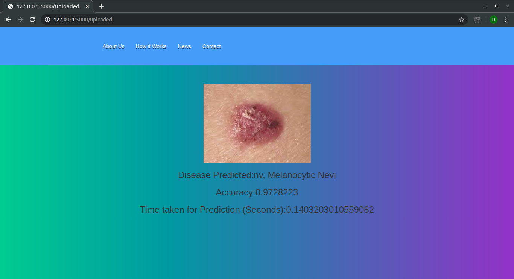

# Skin Disease Detection using AI at the Edge

Skin Disease Detection at edge predicts the disease of skin from the image of that infected part in less than one second and that's where AI at the Edge come.

This web app simply take a disease image using a web interface and give the disease name with accuracy and time taken for prediction.

Home page will be like this:-

Click on the identify button of the page.

It will redirect you to upload page:-

Upload the skin disease image:-

Now click on the upload button.

It will give the result as shown in below picture:-

